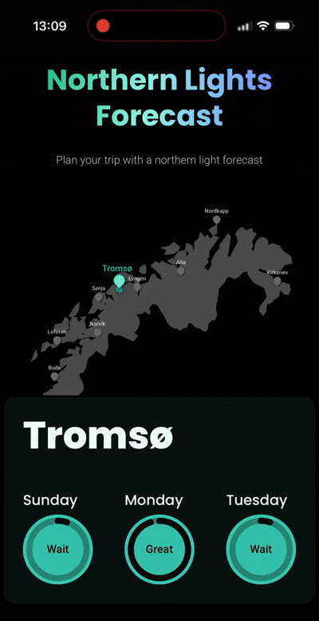
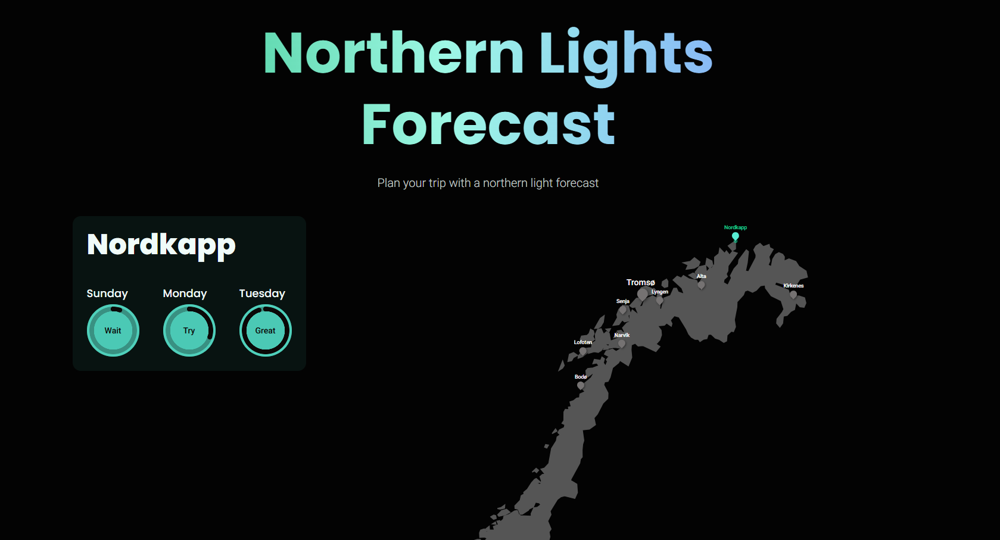

# Northern Lights Forecast

A web application designed to help users find the optimal time and place to experience the Aurora Borealis in Northern Norway. 

This project was built to solve a real-world problem: predicting the Northern Lights requires analyzing multiple independent data points simultaneously. This application aggregates data from various sources to calculate a single, reliable "Aurora Score" for several key locations.

 &nbsp; &nbsp; 

## Technical Overview

The application is built with a focus on data processing, aggregation, and responsive UI design. Eventually, a search function will be added. 

*   **API Integration & Data Fetching:** The backend systematically fetches live data from multiple external APIs to gather the necessary meteorological and geomagnetic information for various locations in Northern Norway.
*   **Data Processing & Filtering:** Large datasets are processed and filtered to extract only the relevant data points for the specific geographic coordinates and timeframes required.
*   **Custom Aurora Score Algorithm:** The core logic of the application revolves around a custom algorithm that calculates an "Aurora Score" (Great, Good, Try, Wait). This score is derived by evaluating three critical factors for each location and time interval:
    *   **Darkness:** Is the sun far enough below the horizon?
    *   **Cloud Cover:** Is the sky clear enough for visibility?
    *   **KP Index:** Is the geomagnetic activity strong enough in that specific region?
*   **Responsive UI:** The frontend features a highly responsive, modern interface built with React/Next.js and Tailwind CSS. It includes an interactive map that scales dynamically between mobile and desktop viewports, ensuring an optimal user experience across all devices.

## Tech Stack
*   **Frontend:** React, Next.js, Tailwind CSS, DaisyUI, React-Simple-Maps
*   **Data Processing:** Custom JavaScript algorithms for evaluating meteorological and astronomical data.

--- 
*This project was developed as a personal portfolio piece to demonstrate full-stack capabilities, particularly in fetching, aggregating, and processing complex external data into a user-friendly interface.*
